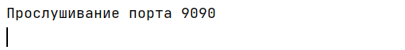
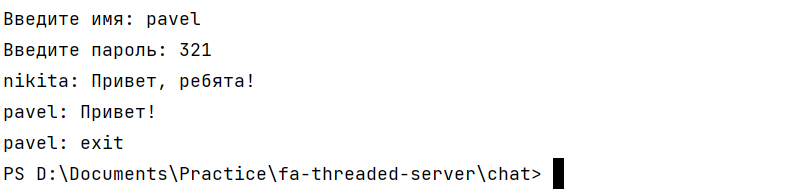
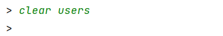

# Лабораторная работа "Многопоточный сервер" по Практикуму по программированию

### Задания для самостоятельного выполнения

1. Модифицировать простой эхо-сервер таким образом, чтобы при подключении клиента создавался новый поток, в котором происходило взаимодействие с ним.

Данный функционал можно увидеть в п. 3, когда к многопоточному серверу одновременно смогут подлючиться несколько пользователей, следовательно, взаимодействие с каждым происходит в новом потоке.

2. Реализовать простой чат сервер на базе сервера аутентификации. Сервер должен обеспечивать подключение многих пользователей одновременно, отслеживание имен пользователей, поддерживать историю сообщений и пересылку сообщений от каждого пользователя всем остальным. 

Сервер:

Клиент 1 (регистрация):

Клиент 2 (регистрация):

Клиент 1:

Клиент 2:

Клиент 2:

Клиент 1:

Клиент 2 (выходит):

Клиент 2 (вход, неверный пароль):

Клиент 2 (вход):

Клиент 1:

3. Реализовать сервер с управляющим потоком. При создании сервера прослушивание портов происходит в отдельном потоке, а главный поток программы в это время способен принимать команды от пользователя. Необходимо реализовать следующие команды:

Сервер (ввод не существующей команды):

Клиент:

    
    1. Отключение сервера (завершение программы);

    
    2. Пауза (остановка прослушивание порта);
    

При подключении клиента его не приветсвуют (запрещают взаимодействовать с сервером) до тех пор, пока сервер не будет снят с паузы.

    3. Показ логов;
    

    4. Очистка логов;
    

    
    5. Очистка файла идентификации.
 

При попытке зайти нас уже не пропускает по имеющемуся токену, хотя он остался с послнеднего логина до очистки, значит, нас просят зарегистрироваться, а значит файл очищен.

